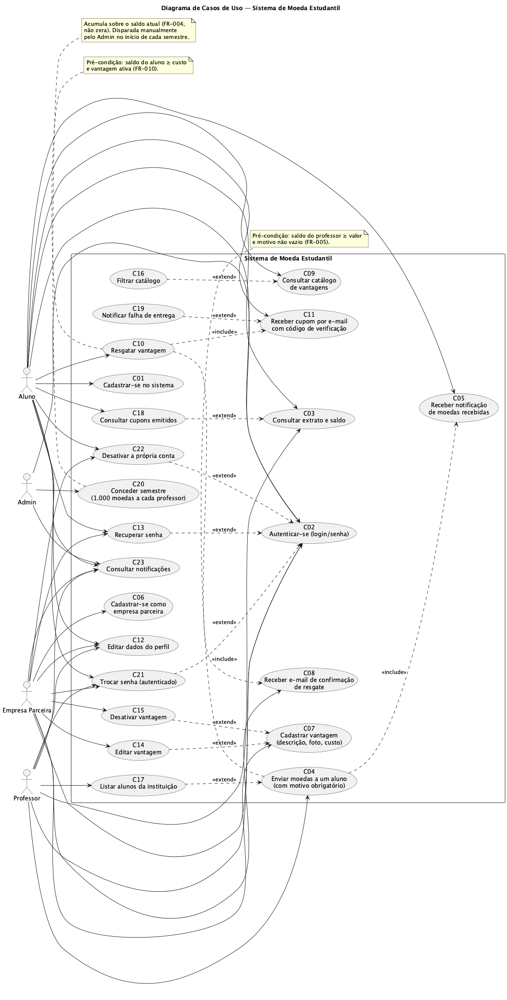
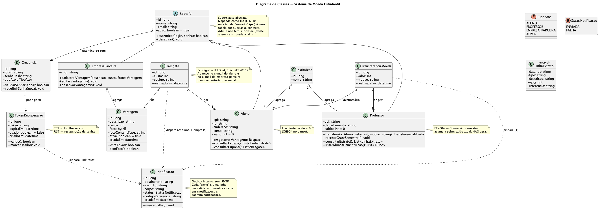
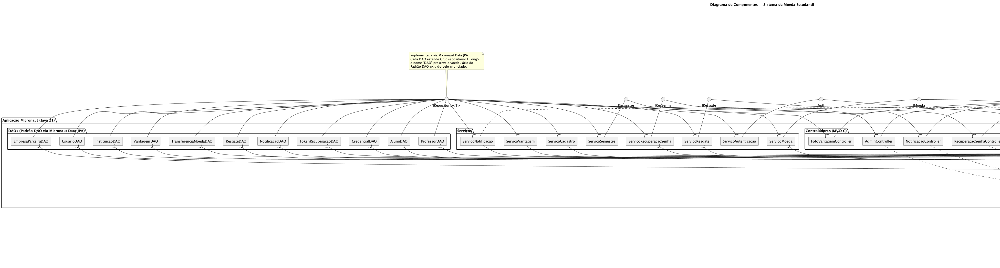
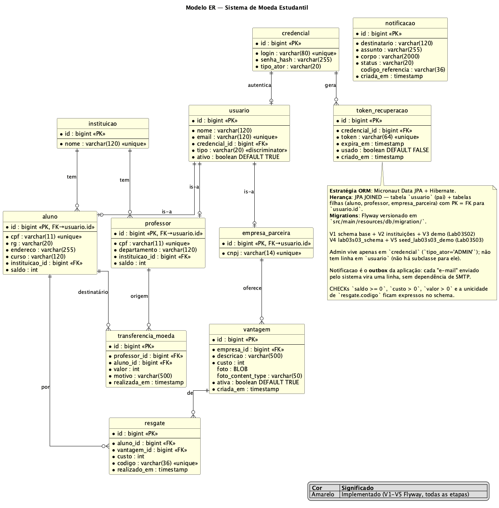

# 🎓 Sistema de Moeda Estudantil

> [!NOTE]
> Sistema para reconhecer o mérito estudantil através de uma **moeda virtual**:
> professores distribuem moedas a alunos como reconhecimento, e alunos trocam
> as moedas por vantagens em empresas parceiras.

Projeto desenvolvido para a disciplina **Laboratório de Desenvolvimento de
Software** (PUC Minas, 2026/1) — Lab03.

---

## 🚧 Status do Projeto


---

## 📚 Índice

- [Sobre o Projeto](#-sobre-o-projeto)
- [Funcionalidades Principais](#-funcionalidades-principais)
- [Tecnologias Utilizadas](#-tecnologias-utilizadas)
- [Arquitetura](#-arquitetura)
- [Instalação e Execução](#-instalação-e-execução)
- [Estrutura de Pastas](#-estrutura-de-pastas)
- [Demonstração](#-demonstração)
- [Testes](#-testes)
- [Autores](#-autores)
- [Licença](#-licença)

---

## 📝 Sobre o Projeto

O **Sistema de Moeda Estudantil** estimula o reconhecimento do mérito acadêmico
através de uma moeda virtual.

- **Quem usa:** Alunos, Professores e Empresas Parceiras de instituições de
  ensino conveniadas.
- **Como funciona:** A cada semestre o Professor recebe 1.000 moedas
  acumulativas; ele distribui aos seus Alunos como reconhecimento, sempre com
  um motivo. Alunos trocam suas moedas por vantagens (descontos, materiais,
  etc.) cadastradas por Empresas Parceiras.
- **Por que existe:** Cria um mecanismo simples e auditável de reconhecimento
  de mérito acadêmico.
- **Contexto:** Trabalho da disciplina **Laboratório de Desenvolvimento de
  Software** (LDS) — PUC Minas, 2026/1.

> **Sprint atual:** Lab03S03 — ciclo completo de moeda implementado:
> transferência Professor→Aluno, catálogo + resgate por cupom,
> notificações (outbox interno em pt-BR), recuperação de senha e
> CRUDs finais.

---

## ✨ Funcionalidades Principais

### Lab03S02 (entregue)

- 🔐 **Autenticação por sessão** — login e logout (Micronaut Security +
  cookie de sessão; BCrypt cost 12).
- 👤 **CRUD de Aluno** — cadastro público, visualização e edição de perfil
  (e-mail, endereço, curso). CPF/RG imutáveis após o cadastro.
- 🏢 **CRUD de Empresa Parceira** — cadastro público, visualização e edição
  de perfil (nome, e-mail). CNPJ imutável.
- 🛡️ **Validações** — formato de CPF (11 dígitos), CNPJ (14 dígitos),
  e-mail; unicidade de CPF, CNPJ, e-mail e login (FR-014).
- 🇧🇷 **pt-BR em todo lugar** — rótulos, mensagens, erros e e-mails (FR-013).

### Lab03S03 (entregue)

- 🧑‍🏫 **Cadastro do Professor** via seed Flyway (FR-003 — instituição envia
  o roster, professor não se auto-cadastra). Login `demo.professor`.
- 💰 **Transferência de moedas** Professor → Aluno com motivo obrigatório
  (US1 / FR-005, FR-006). Operação atômica: saldo do professor cai, saldo
  do aluno sobe, transação é gravada e notificação para o aluno é
  enviada — tudo numa transação JPA.
- 🎟️ **Catálogo de Vantagens** com cards (foto via BLOB), filtros por
  custo máximo e empresa (US9). Empresa parceira cadastra/edita/desativa
  vantagens (US4 + US8) — vantagens desativadas saem do catálogo público
  mas continuam visíveis no histórico dos alunos que já resgataram.
- 🔖 **Resgate por cupom** (US5 / FR-011, FR-015): gera código UUID,
  debita saldo do aluno, dispara duas notificações (cupom para o aluno
  + confirmação para a empresa) com o mesmo código de verificação.
- 📨 **Caixa de notificações** — outbox em tabela (`notificacao`). Cada
  usuário vê suas em `/notificacoes`; admin vê todas em
  `/admin/notificacoes`. Sem dependência de SMTP.
- 🗂️ **Extrato consolidado** (US3): transferências recebidas + resgates,
  ordenados por data.
- 🛂 **Admin** (`demo.admin`): concede semestre — soma 1.000 moedas ao
  saldo de cada professor, acumulando sobre o saldo atual (FR-004).
- 🔑 **Recuperação de senha** (US7): tela pública `/recuperar-senha`,
  token de uso único com TTL 1h, link enviado via notificação.
- 🔁 **Trocar senha** (autenticado, todos os papéis) com confirmação da
  senha atual.
- ❌ **Desativar a própria conta** (soft delete em `usuario.ativo`) —
  login subsequente é rejeitado com `USER_DISABLED`.
- 👥 **Listagem de alunos por instituição** para o Professor (US10).
- 📑 **Cupons emitidos** (US11): `/alunos/cupons` lista todos os
  resgates feitos pelo aluno com data e código.

---

## 🛠 Tecnologias Utilizadas

### 🖥️ Back-end

- **Linguagem:** Java 21 (LTS)
- **Framework:** Micronaut 4.7.x
- **ORM:** Micronaut Data JPA + Hibernate ORM 6.6 (com herança `JOINED`)
- **Migrations:** Flyway
- **Banco:** H2 2.3 em modo arquivo (`./data/moedaestudantil.mv.db`)
- **Autenticação:** Micronaut Security + Session
- **Hash de senha:** BCrypt (`at.favre.lib:bcrypt`)

### 🎨 Front-end

- **Templates:** Thymeleaf 3.x server-rendered
- **Estilo:** CSS próprio (sem frameworks)
- **Comunicação:** HTTP + HTML form-encoded (sem REST/JSON, sem SPA)

### ⚙️ Build & Test

- **Build:** Gradle 9.x (Kotlin DSL)
- **Test:** JUnit 5 + Micronaut Test

---

## 🏗 Arquitetura

O sistema segue a arquitetura **MVC clássica** exigida pelo LAB03:

| Camada MVC | Onde mora                        | Exemplo                         |
| ---------- | -------------------------------- | ------------------------------- |
| **M**odel  | `src/main/java/.../model/`       | `Aluno`, `EmpresaParceira`      |
| **V**iew   | `src/main/resources/views/`      | `aluno-perfil.html` (Thymeleaf) |
| **C**ontroller | `src/main/java/.../controller/` | `AlunoController`               |

Camadas auxiliares:

- **Service** (`service/`) — regras de negócio (`ServicoCadastro`,
  `ServicoAutenticacao`).
- **DAO** (`dao/`) — acesso a dados via Micronaut Data JPA. Os repositórios
  são nomeados `AlunoDAO`, `EmpresaParceiraDAO`, etc., para preservar o
  vocabulário do **Padrão DAO** exigido pelo enunciado.
- **DTO** (`dto/`) — records `@Serdeable` para receber form-data.

### Hierarquia de Usuários (JPA `JOINED`)

`Usuario` é a superclasse abstrata; `Aluno`, `Professor` e `EmpresaParceira`
herdam dela. No banco, temos uma tabela `usuario` (pai) e três tabelas filhas
cuja PK é também FK para `usuario.id`.

### Diagramas

| Casos de Uso | Classe |
| :---: | :---: |
|  |  |
| **Componentes** | **Modelo ER** |
|  |  |

> Fontes em PlantUML: `docs/diagrams/*.puml`. Para regenerar PNGs:
> `plantuml docs/diagrams/*.puml`.

---

## 🔧 Instalação e Execução

### Pré-requisitos

- **Java JDK 21** (ou superior)
- Nada mais. H2 é embedded; Gradle Wrapper baixa a versão certa do Gradle
  automaticamente.

### Passos

```bash
# 1. Clonar o repositório
git clone <url-do-repo>
cd puc-lds-lab-03

# 2. Subir a aplicação (primeira execução baixa Gradle 9.x e dependências)
./gradlew run
```

A aplicação fica disponível em **`http://localhost:8080`**.

> [!NOTE]
> O banco H2 é criado automaticamente em `./data/moedaestudantil.mv.db`
> no primeiro `run`. As migrations Flyway aplicam: V1 schema base, V2
> instituições, V3 seed Lab03S02 (aluno + empresa demo), V4 schema
> Lab03S03 (professor, vantagem, transferência, resgate, notificação,
> token), V5 seed Lab03S03 (admin + professor + 3 vantagens demo).

### Para zerar o banco

```bash
rm -rf data/
./gradlew run
```

### Variáveis de Ambiente

Não há. Toda a configuração está em `src/main/resources/application.yml`.

---

## 📁 Estrutura de Pastas

```text
puc-lds-lab-03/
├── README.md                                      # Este arquivo
├── CLAUDE.md                                      # Notas do agente IA
├── build.gradle.kts                               # Build Gradle (Kotlin DSL)
├── settings.gradle.kts
├── gradle.properties                              # micronautVersion=4.7.6
├── gradlew, gradlew.bat                           # Wrapper Gradle
├── docs/
│   ├── LAB03.md                                   # Enunciado do trabalho
│   ├── user-stories.md                            # US1–US12
│   └── diagrams/
│       ├── use-case.{puml,png}                    # Casos de uso
│       ├── class.{puml,png}                       # Classes
│       ├── component.{puml,png}                   # Componentes
│       └── er.{puml,png}                          # Modelo ER
├── src/
│   ├── main/
│   │   ├── java/br/puc/moedaestudantil/
│   │   │   ├── Application.java
│   │   │   ├── controller/                        # MVC: C
│   │   │   ├── service/
│   │   │   ├── dao/                               # Padrão DAO via Micronaut Data JPA
│   │   │   ├── model/                             # MVC: M (entidades JPA)
│   │   │   ├── dto/                               # Form DTOs (records @Serdeable)
│   │   │   └── exception/
│   │   └── resources/
│   │       ├── application.yml                    # Config principal
│   │       ├── ValidationMessages.properties      # Bean Validation pt-BR
│   │       ├── messages_pt_BR.properties          # UI strings
│   │       ├── views/                             # MVC: V (Thymeleaf)
│   │       ├── public/css/app.css                 # CSS estático
│   │       └── db/migration/                      # V1, V2 SQL
│   └── test/
│       ├── java/br/puc/moedaestudantil/
│       │   ├── controller/
│       │   ├── service/
│       │   └── dao/
│       └── resources/
│           └── application-test.yml
└── data/                                          # Banco H2 local (gitignored)
```

---

## 🎬 Demonstração

> 📋 Roteiro completo passo a passo: **[DEMO.md](DEMO.md)**.

### Credenciais de demo (populadas pelas migrations `V3` e `V5`)

| Perfil    | Login             | Senha           | Após o login vai para     |
| --------- | ----------------- | --------------- | ------------------------- |
| Aluno     | `demo.aluno`      | `aluno1234`     | `/alunos/perfil`          |
| Empresa   | `demo.empresa`    | `empresa1234`   | `/empresas/perfil`        |
| Professor | `demo.professor`  | `prof1234`      | `/professores/perfil`     |
| Admin     | `demo.admin`      | `admin1234`     | `/admin/inicio`           |

### Fluxo de cadastro e login (do zero)

1. Acesse `http://localhost:8080` — você é redirecionado para `/login`.
2. Clique em **"Cadastrar como Aluno"** ou **"Cadastrar Empresa"**.
3. Preencha o formulário, escolha uma das **5 instituições pré-cadastradas**
   (PUC Minas, UFMG, CEFET-MG, UFOP, UNI-BH) e submeta.
4. Você é redirecionado para `/login?cadastrado=1` — faça login com o
   `login`/`senha` que acabou de criar.
5. Após o login, vê seu perfil e pode editá-lo.

### Saída esperada no terminal (`./gradlew run`)

```
 __  __ _                                  _
|  \/  (_) ___ _ __ ___  _ __   __ _ _   _| |_
| |\/| | |/ __| '__/ _ \| '_ \ / _` | | | | __|
| |  | | | (__| | | (_) | | | | (_| | |_| | |_
|_|  |_|_|\___|_|  \___/|_| |_|\__,_|\__,_|\__|
INFO  i.m.flyway.AbstractFlywayMigration - Running migrations for database with qualifier [default]
INFO  o.f.core.internal.command.DbMigrate - Migrating schema "PUBLIC" to version "1 - create schema"
INFO  o.f.core.internal.command.DbMigrate - Migrating schema "PUBLIC" to version "2 - seed instituicoes"
INFO  o.f.core.internal.command.DbMigrate - Successfully applied 2 migrations
INFO  io.micronaut.runtime.Micronaut - Startup completed in 1473ms. Server Running: http://localhost:8080
```

---

## 🧪 Testes

```bash
./gradlew test
```

Cobertura focada em invariantes críticas (não persegue % de cobertura):

| Classe                          | Cobre                                                                          |
| ------------------------------- | ------------------------------------------------------------------------------ |
| `AlunoDAOTest`                  | Unicidade de CPF e e-mail (FR-014) na persistência                             |
| `EmpresaParceiraDAOTest`        | Unicidade de CNPJ                                                              |
| `ProfessorDAOTest`              | Seed V5 deixa demo.professor com saldo 1000 (FR-004); unicidade de CPF         |
| `ServicoCadastroTest`           | Hash BCrypt da senha + rejeição de duplicatas (CPF, CNPJ, login)               |
| `ServicoMoedaTest`              | Transferência: saldo insuficiente, motivo vazio, atomicidade, notificação      |
| `ServicoResgateTest`            | Saldo insuficiente, vantagem desativada, código UUID único, filtro de catálogo |
| `ServicoRecuperacaoSenhaTest`   | Token expirado/usado, troca de senha BCrypt verificável, senha curta           |
| `AlunoControllerTest`           | GET /cadastro público, POST sucesso (303), POST duplicado (form pt-BR)         |
| `EmpresaParceiraControllerTest` | Idem, fluxo de empresa                                                         |
| `LoginControllerTest`           | Tela de login renderiza, mensagens pt-BR de erro/sucesso                       |

Resultado esperado: **`BUILD SUCCESSFUL`** com ~30 testes.

---

## 👨‍💻 Autores

| Foto | Nome | E-mail | GitHub |
| :---: | :---: | :---: | :---: |
| 👤 | Samuel Jansem | sj@tsl.io | [@samueljansem](https://github.com/samueljansem) |

> _Substitua acima conforme os integrantes reais do grupo._

---

## 📜 Licença

Projeto acadêmico — uso restrito à disciplina LDS / PUC Minas.
